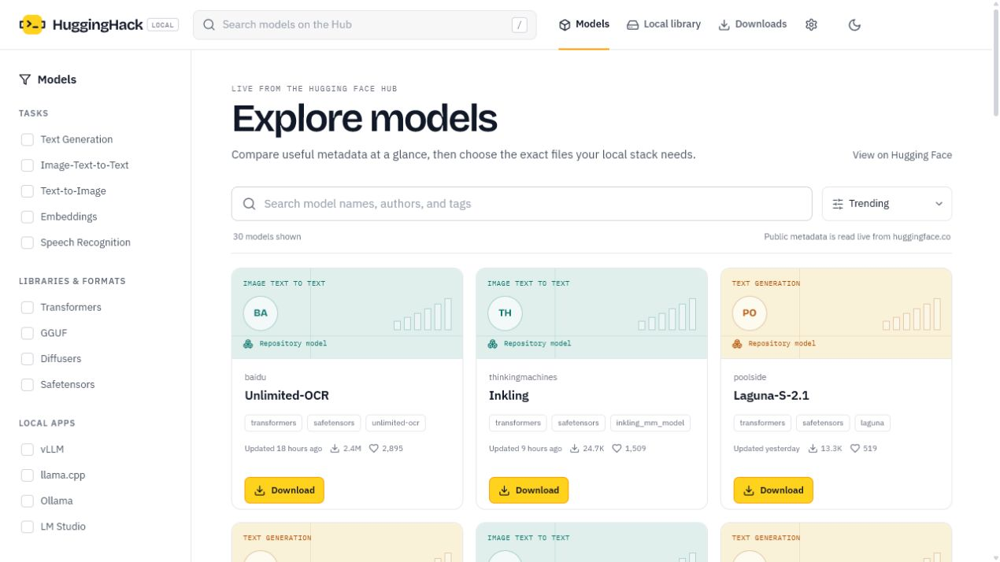
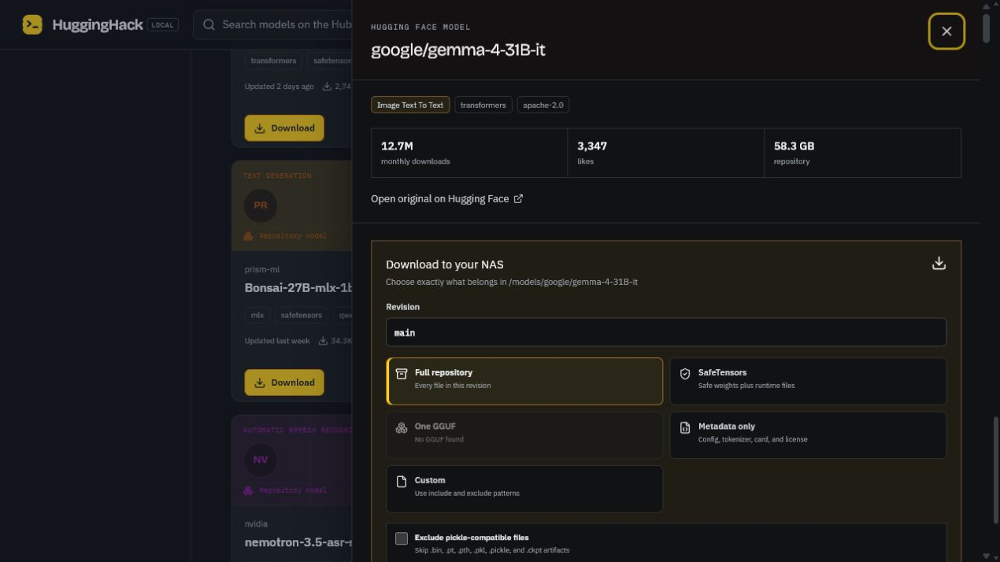
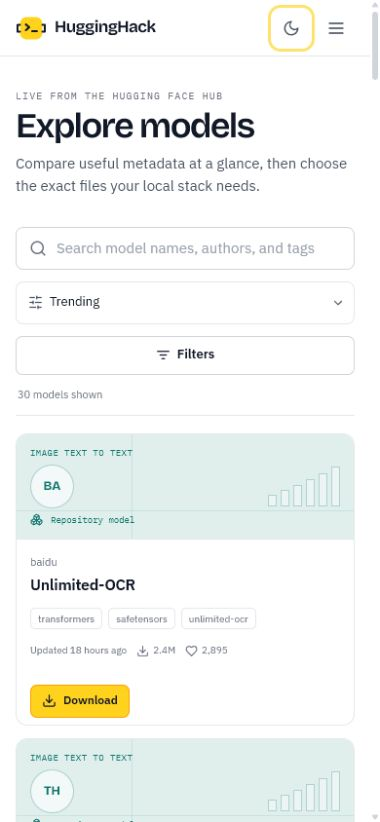

<p align="center">
  
</p>

<h1 align="center">HuggingHack</h1>

<p align="center">
  <strong>Bring the Hugging Face Hub home.</strong><br>
  Browse live models, choose exactly which files to keep, and build a clean local library on your PC or NAS.
</p>

<p align="center">
  
  
  
  
  
</p>

<p align="center">
  <a href="#features">Features</a> ·
  <a href="#screenshots">Screenshots</a> ·
  <a href="#quick-start-on-this-pc">Quick start</a> ·
  <a href="#move-it-to-the-nas">NAS setup</a> ·
  <a href="#security">Security</a>
</p>



<p align="center"><sub>Live Hub discovery with practical metadata, storage-aware downloads, and no cloud dashboard in the middle.</sub></p>

> [!NOTE]
> HuggingHack is an unofficial, local-first project. It is not affiliated with or endorsed by Hugging Face.

<table>
  <tr>
    <td width="33%" valign="top"><strong>🔎 Discover</strong><br>Search the live model catalog and narrow it by task, format, local app, parameter count, or popularity.</td>
    <td width="33%" valign="top"><strong>🎯 Download precisely</strong><br>Keep a full repository, SafeTensors, one GGUF, metadata only, or your own include and exclude patterns.</td>
    <td width="33%" valign="top"><strong>🏠 Own the library</strong><br>Store models in a plain folder on your disk or NAS and index files you copied there yourself.</td>
  </tr>
</table>

## Features

- Familiar Hub-style model catalog with visual, metadata-driven model cards plus task, format, local-app, parameter, and sort filters
- Live Hugging Face metadata, repository file lists, richly rendered model cards, gated status, likes, and download counts
- Full repository, SafeTensors, single-GGUF, metadata-only, and custom-pattern download modes
- Background downloads with revision selection, byte progress, speed, cancellation, and history
- Restart recovery: interrupted jobs resume through Hugging Face's local-dir metadata
- Automatic local-library indexing with model size, file count, config metadata, and unsafe serialization warnings
- Optional read-only `HF_TOKEN` support for private and gated models
- Light/dark themes and responsive desktop/mobile layouts
- One Docker Compose service with persistent model and application-data mounts

## Screenshots

The catalog above is the main workspace. Open any model to inspect its repository, estimate storage, and choose the exact download mode without leaving the app.

<table>
  <tr>
    <td width="68%" valign="top">
      
    </td>
    <td width="32%" valign="top">
      
    </td>
  </tr>
  <tr>
    <td align="center"><sub>Repository details and file-aware download controls in dark mode</sub></td>
    <td align="center"><sub>The same live catalog on mobile</sub></td>
  </tr>
</table>

## Quick start on this PC

1. Install and start Docker Desktop.
2. Double-click **Start HuggingHack.bat**.
3. Open [http://localhost:7860](http://localhost:7860).

The first launch builds the container. Later launches reuse the image unless the project changes.

Command-line equivalent:

```powershell
Copy-Item .env.example .env
docker compose up --build -d
```

Stop it with **Stop HuggingHack.bat** or:

```powershell
docker compose down
```

Models and the SQLite database are persistent and are not removed by `docker compose down`.

## Choose the model folder

Edit `.env` and set `MODEL_STORAGE_PATH` to the host folder that should contain models:

```dotenv
MODEL_STORAGE_PATH=./models
```

The container sees this folder as `/models`. Managed repositories are stored in a plain hierarchy:

```text
models/
  organization/
    repository/
      .hugginghack.json
      config.json
      model.safetensors
      ...
```

That layout is portable and works with vLLM, llama.cpp, Ollama import workflows, Transformers, Diffusers, and other tools that accept a local repository path.

## Move it to the NAS

Copy the entire `HuggingHack` directory to your NAS, then change only `MODEL_STORAGE_PATH` in `.env`.

The host model folder and the project's `data` folder must exist before the container starts. Synology Container Manager does not always create missing bind-mount sources. For a project stored at `/volume1/docker/HuggingHack`, create them in File Station or over SSH:

```bash
mkdir -p /volume1/docker/HuggingHack/models
mkdir -p /volume1/docker/HuggingHack/data
```

Then set `MODEL_STORAGE_PATH=/volume1/docker/HuggingHack/models`. If you choose another model location, create that exact path first.

Common examples:

```dotenv
# Synology
MODEL_STORAGE_PATH=/volume1/AI/models

# TrueNAS
MODEL_STORAGE_PATH=/mnt/tank/ai/models

# QNAP
MODEL_STORAGE_PATH=/share/Container/models
```

If your NAS enforces Unix ownership, set its user and group IDs:

```dotenv
PUID=1026
PGID=100
```

Find them over SSH with `id your-nas-user`. Then launch from the project directory:

```bash
docker compose up --build -d
```

Open `http://NAS-IP:7860` from another computer on the LAN.

## Gated and private models

1. Sign in at Hugging Face and accept the repository's license or access terms in your browser.
2. Create a read-only user access token.
3. Put it in `.env`:

```dotenv
HF_TOKEN=hf_your_read_token
```

4. Restart the service:

```bash
docker compose up -d
```

The token is read only by the backend container. It is never returned by the API or sent to the browser.

## File filtering

The model drawer offers five download modes:

- **Full repository** downloads every file in the selected revision.
- **SafeTensors** selects safe weights plus configuration and tokenizer files.
- **One GGUF** lets you choose a specific quantization from the repository file list.
- **Metadata only** fetches configuration, tokenizer, and documentation files without weights.
- **Custom** accepts comma-separated include and exclude patterns.

Custom pattern examples:

- Include only SafeTensors and config files: `*.safetensors, *.json, tokenizer*`
- Download one GGUF quantization: `*Q4_K_M.gguf, *.json, tokenizer*`
- Exclude legacy PyTorch weights: `*.bin, *.pt, *.pth`

Patterns use Hugging Face's official `snapshot_download` filtering.

## Cancel and resume

Active downloads have a **Cancel download** action. Cancellation stops the isolated download worker, keeps already transferred files and Hugging Face local-directory metadata, and marks the job as cancelled in history. Starting the same repository again can reuse those partial files instead of discarding the completed work.

## Manually added models

Copy a model folder anywhere within the first few directory levels of the mounted model folder, then choose **Local library → Scan folder**. HuggingHack recognizes common configs and weight extensions such as:

- `config.json`, `model_index.json`, `tokenizer.json`
- `.safetensors`, `.gguf`, `.onnx`, `.bin`, `.pt`, `.pth`, and `.ckpt`

Manually copied models are indexed but never modified.

## Security

- HuggingHack downloads files but does not execute repository code, import model modules, or deserialize weights.
- Model cards are rendered as sanitized Markdown with safe HTML, readable code, tables, lists, and math; embedded scripts, forms, and frames are discarded.
- Pickle-compatible formats can execute code when loaded by other applications. Prefer SafeTensors or GGUF and only load models from publishers you trust.
- The default Compose file is intended for a trusted home LAN. If you expose it beyond the LAN, put it behind TLS and authentication using a reverse proxy such as Caddy, Traefik, or Nginx Proxy Manager.
- Use a read-only Hugging Face token.

## Development

Backend:

```powershell
py -3.13 -m venv .venv
.venv\Scripts\pip install -r backend\requirements.txt
$env:MODEL_STORAGE="$PWD\models"
$env:DATA_DIR="$PWD\data"
.venv\Scripts\uvicorn app.main:app --app-dir backend --reload --port 7860
```

Python 3.12 or 3.13 is recommended for local development. The Docker image uses Python 3.12, so Python is not required on the NAS.

Frontend:

```powershell
Set-Location frontend
npm install
npm run dev
```

The Vite development server proxies `/api` to port 7860.
Frontend development and production builds require Node.js 22 or newer. The lockfile is maintained with npm 10.9.8.

Tests and build:

```powershell
$env:PYTHONPATH="$PWD\backend"
pytest backend\tests
Set-Location frontend
npm test
npm run build
```

## Data ownership and backups

- Models: the host path configured by `MODEL_STORAGE_PATH`
- Download history and local index: `./data/hugginghack.sqlite3`
- Hub metadata cache: `./data/hub-cache`

Back up the models folder and `data` directory. The index can be rebuilt from model files, but the SQLite database preserves download history.
